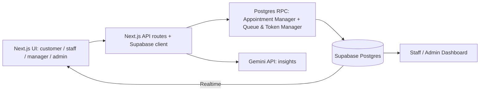

# AGENT BUILD GUIDE: Digital Queue & Appointment Management System

> **You are a senior full-stack engineer.** Build this project step by step inside a **6-hour hackathon**. Follow the phases in order. After each phase, run the **Verify** checklist, fix problems, **commit to Git**, and only then continue. Do not skip ahead. Do not add features that are not listed.

---

## 0. RULES FOR THE AGENT (READ FIRST)

1. **Working demo beats completeness.** Judges watch a demo video and test a live URL. Everything in the "Demo Checklist" (section 1) must work end to end.
2. **One phase at a time.** Finish, verify, commit, then move on. Print a short status after each phase: `Phase N done: what works / what is broken`.
3. **Write complete files**, never snippets with placeholders. No `// TODO`, no `...rest of code`.
4. **Keep it simple.** Prefer fewer files, fewer dependencies, and boring solutions.
5. **Deploy early.** A working skeleton must be live on Vercel by the end of Phase 5. Redeploy after every phase.
6. **Never commit secrets.** `.env.local` is in `.gitignore`. Provide `.env.example` only.
7. **All business rules live in Postgres functions (RPC)** so they are atomic (no overbooking, no duplicate tokens).
8. **If something is blocked for more than 15 minutes**, use the fallback listed for that phase and continue.
9. **Cut order if running late:** reschedule, then rules admin page, then email, then staff recommendation. **Never cut:** token calling, live queue, dashboard, deployment.
10. After finishing everything, produce `PROJECT_STRUCTURE.md` and a `README.md` (Phase 11).

---

## 1. PROJECT BRIEF

**Problem:** People stand physically in queues at banks, clinics, universities, and government offices without knowing how long they will wait. Staff face crowding, no clear queue order, mixed walk-ins and appointments, missed appointments, overloaded counters, and no data about peak hours.

**Solution:** A web app where users **book appointments** or **join a digital queue** (get a token), see **live position and estimated waiting time**, and staff/managers run counters, call tokens, handle no-shows, and view analytics, with AI-powered predictions and insights.

**Core flow:**

```
User selects service -> books appointment OR gets token -> queue position assigned
-> waiting time estimated -> staff calls user -> service completed -> queue & analytics updated
```

### Demo Checklist (judges verify all of these in the video)

- [ ] Appointment booking
- [ ] Walk-in token generation
- [ ] Live queue
- [ ] Waiting-time estimation
- [ ] Counter / staff workflow
- [ ] Token calling
- [ ] Check-in and completion
- [ ] Dashboard and analytics

### Submission requirements

1. Demo video (appointment booking, walk-in token, live queue, wait estimate, counter/staff workflow, token calling, check-in + completion, dashboard)
2. GitHub link **and** deployed link (submit both)
3. Project explanation document (`PROJECT_STRUCTURE.md` exported to PDF): important folders/files, purpose of each, where appointment & queue logic lives, where AI lives, how frontend/backend/database connect

---

## 2. TECH STACK (FIXED, DO NOT CHANGE)

| Layer | Choice |
|---|---|
| Framework | **Next.js 14+ (App Router) + TypeScript** |
| Styling/UI | **Tailwind CSS + shadcn/ui + lucide-react** |
| Charts | **Recharts** (via shadcn charts) |
| Database/Auth/Realtime | **Supabase** (Postgres, Auth, Realtime) via `@supabase/ssr` |
| Validation | **zod** |
| AI | **Google Gemini API** (server-side route only) |
| Hosting | **Vercel** |
| Rate limiting | Simple in-memory limiter (Upstash only if time allows) |

**Fallback:** If Supabase Realtime misbehaves, poll every 5 seconds with `setInterval` + refetch.

### Environment variables (`.env.example`)

```
NEXT_PUBLIC_SUPABASE_URL=
NEXT_PUBLIC_SUPABASE_ANON_KEY=
SUPABASE_SERVICE_ROLE_KEY=      # server only, never expose to the client
GEMINI_API_KEY=                 # server only
APP_TIMEZONE=UTC                # set to the venue's timezone, used for "today" and slots
```

### Design direction

Modern light SaaS dashboard: off-white background (`#F5F5F5`), white cards with `rounded-2xl`, very soft shadows, thin borders, **one green accent** (`#22C55E`), Inter/Geist font, big bold numbers with small muted labels, left sidebar for staff/manager/admin, status pills (green/amber/red). Every screen needs **loading skeletons, empty states, and friendly error messages**. Fully responsive (customer pages are mobile-first).

---

## 3. USER ROLES

| Role | Can do |
|---|---|
| **Customer** | Register/login, choose department & service, view slots, book appointment, get walk-in token, see live position & wait time, check in, cancel/reschedule, notifications, history |
| **Staff** | See waiting list for their counter/service, set counter status, call next, start, complete, skip, recall, mark missed, see appointment details |
| **Manager** | Everything staff can see + manage counters/staff in their department, services, working hours, durations, limits, view queue length, workload, wait stats, AI insights |
| **Admin** | Manage departments, users, roles, services, rules; org-wide activity, reports, analytics |

**Demo accounts (seed these; list them in README):**

| Email | Password | Role |
|---|---|---|
| admin@demo.com | Demo@12345 | admin |
| manager@demo.com | Demo@12345 | manager |
| staff@demo.com | Demo@12345 | staff |
| staff2@demo.com | Demo@12345 | staff |
| customer@demo.com | Demo@12345 | customer |
| customer2@demo.com | Demo@12345 | customer |

---

## 4. ROUTES (KEEP TO THESE)

| Route | Access | Purpose |
|---|---|---|
| `/` | Public | Landing: "Book Appointment" or "Get Token" |
| `/login`, `/register` | Public | Auth |
| `/book` | Customer | Department > Service > Date > Slot > Confirm |
| `/token` | Customer | Pick service, get token |
| `/my` | Customer | Live status (token, position, ETA), check-in, cancel/reschedule, history, notifications |
| `/display` | Public | Big-screen "Now Serving" board (e.g. `A-027 -> Counter 3`) |
| `/staff` | Staff | Counter control + waiting list + actions |
| `/manager` | Manager/Admin | Dashboard, analytics, AI insights, counters/services settings |
| `/admin` | Admin | Departments, users/roles, services, rules, activity log |

API routes: `/api/ai/insights`, `/api/ai/staff-recommendation` (optional), `/api/cron/mark-missed` (optional). Most logic is Supabase RPC.

---

## 5. DATABASE SCHEMA (PHASE 1 RUNS THIS)

Save as `supabase/schema.sql`.

```sql
create extension if not exists pgcrypto;

create type user_role as enum ('customer','staff','manager','admin');

create table departments (
  id uuid primary key default gen_random_uuid(),
  name text not null,
  open_time time not null default '09:00',
  close_time time not null default '17:00',
  break_start time,
  break_end time,
  slot_minutes int not null default 30,
  max_per_slot int not null default 6,
  created_at timestamptz default now()
);

create table profiles (
  id uuid primary key references auth.users on delete cascade,
  name text,
  email text,
  phone text,
  role user_role not null default 'customer',
  department_id uuid references departments,
  account_status text not null default 'active',
  no_show_count int not null default 0,
  created_at timestamptz default now()
);

create table services (
  id uuid primary key default gen_random_uuid(),
  department_id uuid not null references departments on delete cascade,
  name text not null,
  prefix char(1) not null default 'A',
  avg_duration int not null default 5,       -- minutes
  priority_level int not null default 0,     -- higher = served earlier
  active boolean not null default true
);

create table counters (
  id uuid primary key default gen_random_uuid(),
  department_id uuid not null references departments on delete cascade,
  name text not null,
  service_id uuid references services,
  assigned_staff uuid references profiles,
  status text not null default 'closed',     -- available | busy | break | closed
  current_token uuid
);

create table appointments (
  id uuid primary key default gen_random_uuid(),
  user_id uuid not null references profiles,
  service_id uuid not null references services,
  appointment_date date not null,
  start_time time not null,
  end_time time not null,
  status text not null default 'confirmed',  -- booked|confirmed|checked_in|waiting|in_service|completed|cancelled|missed|rescheduled|delayed
  check_in_time timestamptz,
  ref_no text unique,
  no_show_risk numeric,
  created_at timestamptz default now()
);

create table tokens (
  id uuid primary key default gen_random_uuid(),
  token_number text not null,                -- A-027
  user_id uuid references profiles,
  service_id uuid not null references services,
  appointment_id uuid references appointments,  -- null = walk-in
  counter_id uuid references counters,
  status text not null default 'waiting',    -- waiting|called|no_response|recalled|in_service|completed|skipped|missed
  queue_position int,
  estimated_wait int,                        -- minutes
  recall_count int not null default 0,
  created_at timestamptz default now(),
  called_at timestamptz,
  started_at timestamptz,
  completed_at timestamptz
);

create table notifications (
  id uuid primary key default gen_random_uuid(),
  user_id uuid not null references profiles,
  message text not null,
  type text,
  read boolean not null default false,
  created_at timestamptz default now()
);

create table activity_logs (
  id uuid primary key default gen_random_uuid(),
  actor uuid,
  action text not null,
  entity text,
  entity_id uuid,
  created_at timestamptz default now()
);

create table rules (
  department_id uuid primary key references departments on delete cascade,
  max_appts_per_user_day int not null default 2,
  max_active_tokens int not null default 1,
  cancel_limit int not null default 3,
  late_checkin_minutes int not null default 10,
  early_checkin_minutes int not null default 10
);

create index on tokens (service_id, status, created_at);
create index on tokens (user_id, status);
create index on appointments (appointment_date, service_id, start_time);
create index on notifications (user_id, read);

-- auto-create profile on signup
create or replace function handle_new_user() returns trigger
language plpgsql security definer set search_path = public as $$
begin
  insert into profiles (id, name, email, role)
  values (new.id, coalesce(new.raw_user_meta_data->>'name', split_part(new.email,'@',1)), new.email, 'customer');
  return new;
end $$;

create trigger on_auth_user_created after insert on auth.users
for each row execute function handle_new_user();

-- enable realtime
alter publication supabase_realtime add table tokens, counters, appointments, notifications;
```

---

## 6. CORE LOGIC (PHASE 2 AND 3 IMPLEMENT THIS)

Save as `supabase/functions.sql`. All functions use `security definer` with explicit role checks using `auth.uid()`.

### 6.1 Wait-time estimation

```
wait_minutes = ceil(people_ahead / max(active_counters, 1)) * avg_service_time
avg_service_time = average(completed_at - started_at) of last 20 completed tokens for the service (minutes)
                   fallback: services.avg_duration
active_counters  = counters for that service/department with status in ('available','busy')
```

Example from the brief: 5 ahead, 4 min average, 2 active counters = `ceil(5/2) * 4 = 12`. The brief's illustration says 10 min (5 x 4 / 2). Use the **linear version** `(people_ahead * avg) / active_counters` rounded up, so the example matches exactly: `ceil(5*4/2) = 10`. **Use this formula:**

```
wait = ceil( people_ahead * avg_service_time / greatest(active_counters,1) )
```

### 6.2 SQL helpers and functions to write

```sql
-- Average service time for a service
create or replace function avg_service_minutes(p_service uuid) returns numeric
language sql stable as $$
  select coalesce(
    (select avg(extract(epoch from (completed_at - started_at))/60)
       from (select completed_at, started_at from tokens
             where service_id = p_service and status='completed'
               and started_at is not null and completed_at is not null
             order by completed_at desc limit 20) t),
    (select avg_duration from services where id = p_service)
  );
$$;

-- Recalculate positions + waits for all waiting tokens of a service
create or replace function recalc_queue(p_service uuid) returns void
language plpgsql security definer set search_path=public as $$
declare v_active int; v_avg numeric; v_dept uuid;
begin
  select department_id into v_dept from services where id = p_service;
  select count(*) into v_active from counters
    where department_id = v_dept and status in ('available','busy')
      and (service_id is null or service_id = p_service);
  v_avg := avg_service_minutes(p_service);
  with ordered as (
    select id, row_number() over (
      order by (appointment_id is null), created_at   -- appointments first, then FIFO
    ) as pos
    from tokens where service_id = p_service and status in ('waiting','recalled')
  )
  update tokens t
     set queue_position = o.pos,
         estimated_wait = ceil(((o.pos - 1) + 1) * v_avg / greatest(v_active,1))::int
    from ordered o where t.id = o.id;
end $$;
```

**Agent must also write (complete SQL, in `functions.sql`):**

1. **`create_token(p_service uuid)`**
   - Requires `auth.uid()`. Use `pg_advisory_xact_lock(hashtext(p_service::text))` to avoid race conditions.
   - Reject if the user already has an active token (`waiting|called|recalled|in_service`). Raise a clear message: `You already have an active token`.
   - Respect `rules.max_active_tokens`.
   - Next number = count of today's tokens for that service + 1, formatted `prefix || '-' || lpad(n::text,3,'0')`.
   - Insert token, call `recalc_queue`, return the row.
2. **`book_appointment(p_service uuid, p_date date, p_start time)`**
   - Lock with `pg_advisory_xact_lock(hashtext(p_service::text || p_date::text || p_start::text))`.
   - Validate: date not in the past, inside working hours, not in break, aligned to slot size.
   - Slot capacity: count appointments (status not in `cancelled|missed|rescheduled`) for the department+date+start_time < `departments.max_per_slot`. **Never allow overbooking.**
   - Prevent duplicate (same user, service, date, start) and enforce `rules.max_appts_per_user_day`.
   - `end_time = start_time + services.avg_duration`. Generate `ref_no` like `APT-XXXXXX`.
   - Insert notification "Appointment confirmed". Return the row.
3. **`get_available_slots(p_service uuid, p_date date)`**: returns each slot with `start_time`, `end_time`, `max`, `booked`, `status` (`available|full`). Excludes break time and past slots for today.
4. **`check_in(p_appointment uuid)`**
   - Only the owner. Allowed from `start - early_checkin_minutes` to `start + late_checkin_minutes`; otherwise raise a clear error.
   - Set status `waiting`, `check_in_time = now()`, create a linked token with `appointment_id` (appointment tokens get priority), call `recalc_queue`.
5. **`call_next_token(p_counter uuid)`**
   - Staff/manager/admin only. Lock the counter row. Pick the next token for the counter's service (or department if service is null) with status `waiting` or `recalled`, ordered: **appointment tokens first, then higher `services.priority_level`, then `created_at`**; use `for update skip locked`.
   - Set `status='called'`, `counter_id`, `called_at=now()`; counter `status='busy'`, `current_token`.
   - Insert notification: `Token A-027: please proceed to Counter 3`. Insert activity log. Call `recalc_queue`.
6. **`start_service(p_token uuid)`**: `called -> in_service`, set `started_at`, appointment status `in_service`.
7. **`complete_service(p_token uuid)`**: `in_service -> completed`, set `completed_at`, appointment `completed`, counter `available` and `current_token = null`, log, `recalc_queue`.
8. **`recall_token(p_token uuid)`**: status `recalled`, `recall_count+1`, re-notify the user.
9. **`skip_token(p_token uuid)`**: status `skipped`, free the counter, log, `recalc_queue`.
10. **`mark_token_missed(p_token uuid)`**: status `missed`; appointment `missed`; `profiles.no_show_count += 1`; free the counter.
11. **`set_counter_status(p_counter uuid, p_status text)`**: staff/manager only; if set to `break` or `closed` while it has a current token, refuse until it is completed or skipped; then **call `recalc_queue` for the counter's service(s)** so estimates update immediately (**dynamic queue management**).
12. **`mark_missed_appointments()`**: appointments with status `confirmed|booked` whose `start_time + late_checkin_minutes` has passed become `missed` (slot freed because missed is excluded from the capacity count) and increment `no_show_count`. Call it lazily when `/staff` and `/manager` load, and optionally from a Vercel cron.
13. **`cancel_appointment(p_appointment uuid)`**: owner only, enforce `cancel_limit`, status `cancelled`, notify.
14. **`reschedule_appointment(p_appointment uuid, p_date date, p_start time)`**: cancel old + book new in one transaction; mark old as `rescheduled`. (Cut this if short on time.)
15. **Reminder notification:** a function `send_reminders()` creating "Your appointment is in 1 hour" and "You are next in line" (position <= 2) notifications; call it lazily from the same place as `mark_missed_appointments`.

### 6.3 Row Level Security (Phase 10 finalizes this, but enable RLS from the start)

```sql
alter table profiles enable row level security;
alter table appointments enable row level security;
alter table tokens enable row level security;
alter table notifications enable row level security;
alter table counters enable row level security;
alter table activity_logs enable row level security;
alter table departments enable row level security;
alter table services enable row level security;
alter table rules enable row level security;

create or replace function current_role_name() returns user_role
language sql stable security definer as $$ select role from profiles where id = auth.uid() $$;

-- examples (agent: complete for every table)
create policy "own profile" on profiles for select using (id = auth.uid() or current_role_name() in ('staff','manager','admin'));
create policy "own appointments" on appointments for select using (user_id = auth.uid() or current_role_name() in ('staff','manager','admin'));
create policy "own tokens" on tokens for select using (user_id = auth.uid() or current_role_name() in ('staff','manager','admin'));
create policy "own notifications" on notifications for select using (user_id = auth.uid());
create policy "read departments" on departments for select using (true);
create policy "read services" on services for select using (true);
create policy "read counters" on counters for select using (true);
-- writes happen through RPC functions only; deny direct inserts/updates from clients.
-- /display needs public read of counters + called tokens: expose a view `public_display` (token_number, counter_name, status) and grant select to anon.
```

---

## 7. AI FEATURES (PHASE 8)

Build these three (the brief says AI features are optional but boost judging):

### 7.1 Smart waiting-time prediction (`lib/ai/waitTime.ts`)
Uses the formula in 6.1 with a rolling average of the last 20 completed services, updates live as the queue changes. In the UI label it **"AI-estimated wait"** and show a small "based on N recent services" tooltip. Optional improvement: weight the average by the current hour of day (peak hours are slower).

### 7.2 No-show prediction (`lib/ai/noShow.ts`)
Heuristic risk score 0 to 1, no external ML:

```
risk = 0.10
     + min(0.45, 0.15 * user.no_show_count)
     + (booked less than 2 hours before the slot ? 0.20 : 0)
     + (slot is early morning or last slot of day ? 0.10 : 0)
     + (user has cancelled/rescheduled this appointment before ? 0.10 : 0)
clamp to [0,1]
badge: <0.3 Low (green), 0.3-0.6 Medium (amber), >0.6 High (red)
```
Store in `appointments.no_show_risk` at booking time. Show the badge in the staff and manager views.

### 7.3 AI Management Insights (`app/api/ai/insights/route.ts`)
- Server-side only. Require the manager/admin role (verify the Supabase session).
- Aggregate stats with SQL: waiting time by department, queue length by hour, busiest service, peak hours, no-show rate, cancellation rate, counters active.
- Send the aggregated JSON (never raw personal data) to Gemini with this system prompt:

```
You are an operations analyst for a service organization. Given the aggregated queue statistics
as JSON, return ONLY a JSON array of 3 to 5 short insight strings (max 25 words each) that are
specific, quantified, and actionable. Example: "Document Verification experiences its longest
queues between 11 AM and 1 PM." No markdown, no preamble, no code fences.
```
- Strip code fences, parse, **validate with zod** (array of 3 to 5 strings). Cache the result for 5 minutes in memory. Rate-limit to 10 requests per minute per user. On failure return rule-based fallback insights computed from the stats (so the demo never breaks).

### 7.4 Optional: Smart staff recommendation (`lib/ai/staffRecommendation.ts`)
`recommended_counters = ceil(expected_demand_per_hour * avg_service_minutes / 60)` where expected demand is the historical average tokens for that hour and weekday. Show on the manager dashboard: "Recommended active counters at 11 AM: 4 (currently 2)".

---

## 8. PHASES: DO THESE IN ORDER

### PHASE 0: Project setup (15 min)
**Tasks**
1. Create a Next.js app: `npx create-next-app@latest queue-system --typescript --tailwind --app --eslint --src-dir=false --import-alias "@/*"`.
2. Init shadcn/ui: `npx shadcn@latest init`, then add: `button card input select badge avatar dialog tabs table skeleton sonner dropdown-menu calendar sidebar chart`.
3. Install: `npm i @supabase/supabase-js @supabase/ssr zod lucide-react recharts date-fns @google/generative-ai`.
4. Create `.env.example`, ensure `.gitignore` contains `.env*.local`.
5. `git init`, first commit, push to GitHub.

**Verify:** `npm run dev` shows the page; repo is on GitHub.

### PHASE 1: Database and auth (30 min)
**Tasks**
1. Run `supabase/schema.sql` in the Supabase SQL editor.
2. Build `lib/supabase/client.ts` (browser) and `lib/supabase/server.ts` (server) using `@supabase/ssr`.
3. `middleware.ts`: refresh session; protect `/book /token /my` (any logged-in user), `/staff` (staff, manager, admin), `/manager` (manager, admin), `/admin` (admin). Redirect unauthorized users with a friendly message.
4. Build `/login` and `/register` (email + password, zod validation, error toasts).
5. Navbar/sidebar that changes by role.
6. In Supabase Auth settings, **disable email confirmation** so demo accounts work instantly.

**Verify:** Register and log in; a customer is blocked from `/staff`; manually setting `role='staff'` in the DB opens `/staff`.

### PHASE 2: Token flow and live status (45 min)
**Tasks**
1. Write `create_token`, `recalc_queue`, `avg_service_minutes` in `supabase/functions.sql` and run it.
2. `/token`: service selector (grouped by department), "Get Token" button, show the result card: **Token A-027, Current token, People ahead: 6, Estimated wait: 18 min**, and "You can wait nearby instead of standing in line."
3. `/my`: live card for the active token (position, ETA, status), subscribed to Supabase Realtime on `tokens` filtered by the user. Plus a notifications bell and visit history list.
4. Handle errors: duplicate active token, service inactive, network failure.

**Verify:** Two customers get tokens A-001 and A-002; positions are correct; a second token for the same user is rejected with a clear message.

### PHASE 3: Staff workflow (45 min)
**Tasks**
1. Write `call_next_token`, `start_service`, `complete_service`, `recall_token`, `skip_token`, `mark_token_missed`, `set_counter_status`.
2. `/staff`: choose counter, status toggle (Available/Busy/Break/Closed), big **Call Next** button, "Now serving" card, waiting list with badges (appointment vs walk-in, no-show risk), buttons Start / Complete / Skip / Recall / Mark Missed. Realtime-subscribe to `tokens`.
3. Log every action in `activity_logs`.
4. `/display`: public full-screen board with **Now Serving** tokens per counter in large type and a "Next up" list, realtime.

**Verify:** Staff calls A-001; the customer `/my` and `/display` update instantly without a refresh; closing a counter raises other waiting customers' ETA.

### PHASE 4: Appointments (45 min)
**Tasks**
1. Write `get_available_slots`, `book_appointment`, `check_in`, `cancel_appointment`, `mark_missed_appointments` (and `reschedule_appointment` if time permits).
2. `/book` wizard: Department > Service > Date (next 7 days) > Slot grid (Full slots disabled with a "Full" badge) > Confirm. Show the confirmation with the reference number.
3. `/my`: upcoming appointments list with **Check In** (enabled only inside the window, otherwise shows when it opens), Cancel, Reschedule.
4. Call `mark_missed_appointments()` when `/staff` and `/manager` load.

**Verify:** Booking a full slot is rejected; check-in outside the window is rejected; check-in inside the window creates a priority token; an appointment not checked in becomes Missed and the slot reopens.

### PHASE 5: Seed data and FIRST DEPLOY (30 min)
**Tasks**
1. Write `supabase/seed.sql` (or `scripts/seed.ts` using the service role key):
   - 3 departments: **Student Affairs**, **Examination**, **Accounts**, each with working hours 9:00 to 17:00, a break at 13:00 to 14:00, 30-min slots, 6 per slot.
   - 2 to 3 services each, durations 5, 10, 20 minutes (e.g. Document Verification 5, Certificate Verification 10, New Registration 20), prefixes A, B, C...
   - 5 counters (Counter 1 Document Verification, Counter 2 Registration, Counter 3 Fee Queries, etc.), with the staff user assigned.
   - The six demo accounts from section 3, with correct roles.
   - **~14 days of historical completed/missed/cancelled tokens and appointments** with realistic patterns: peak at 11:00 to 13:00, busier Mondays/Tuesdays, avg service time varying by service, ~10% no-shows, ~8% cancellations. Spread across departments. (This makes the charts, predictions, and insights look real.)
2. Push to GitHub, import into Vercel, add all env vars, deploy.
3. Test the live URL: register, token, staff call. On the phone too.

**Verify:** Live URL works end to end. **If deployment fails, fix it now before building more.**

### PHASE 6: Manager dashboard and analytics (45 min)
**Tasks**
1. `/manager` in the light-dashboard style: sidebar, top stat cards, charts, auto-refresh every 10 seconds.
2. **Stat cards:** Appointments today, Walk-in tokens, Currently waiting, Active counters, Completed, Missed, Avg waiting time, Avg service duration, Busiest department, Busiest service, Peak hour.
3. **Charts (Recharts):** queue length by hour (bar, highlight peak bar in green), waiting time by department, staff workload (completed per staff), service completion time, no-show rate and cancellation rate, daily and weekly visitor trend (line).
4. Use SQL views or RPC (`get_dashboard_stats(p_from, p_to)`) so aggregation is done in the database.
5. Counter management panel: list counters, change status, assign staff and service. Service management: edit duration, active flag. Department settings: working hours, slot size, max per slot.

**Verify:** All numbers are non-zero from the seed history and change when you act as staff.

### PHASE 7: Notifications and rules (30 min)
**Tasks**
1. Notifications are created by the RPCs for: appointment confirmed, appointment approaching, queue position getting close (position <= 2), called to a counter, rescheduled, delayed, cancelled.
2. Bell dropdown with unread count (realtime), mark as read, and a toast when a new notification arrives.
3. `/admin`: tabs for Departments, Users (change role), Services, Rules (max appointments per user per day, max tokens, cancellation limit, late check-in minutes), Activity log.
4. Enforce rules inside the RPCs (already specified in section 6.2).

**Verify:** Calling a token pops a toast on the customer screen; changing a rule changes behavior.

### PHASE 8: AI features (30 min)
Implement section 7.1 to 7.4. Show the **AI Insights** card on `/manager`, the **no-show risk badge** in the staff waiting list, the **AI-estimated wait** label on `/my`, and the **staff recommendation** card.

**Verify:** The insights card shows 3 to 5 sentences; with `GEMINI_API_KEY` removed, the fallback insights still appear.

### PHASE 9: Debug and polish (30 min)
**Tasks**
1. Test every item in the Demo Checklist manually, as each role, in an incognito window.
2. Test weird inputs: empty forms, double-clicking buttons (disable while submitting), booking a past date, two staff calling at once, offline error.
3. Mobile responsiveness on customer pages; skeletons and empty states everywhere; consistent toasts.
4. Fix any bug found. Commit.

### PHASE 10: Security pass (20 min)
**Checklist (fix everything that fails):**
- [ ] RLS enabled on all tables; policies complete (customers see only their own data; staff/manager only their department where applicable; admin everything); clients cannot directly insert/update `tokens`, `appointments`, `counters`, `profiles.role`.
- [ ] Every RPC checks `auth.uid()` and the role; `security definer` functions set `search_path = public`.
- [ ] A user cannot change their own role (policy or trigger).
- [ ] `SUPABASE_SERVICE_ROLE_KEY` and `GEMINI_API_KEY` are never in client code or committed.
- [ ] Zod validation on all API routes and forms; input length limits.
- [ ] Role check + rate limit on `/api/ai/*`; AI prompt receives only aggregated stats, never user-supplied free text.
- [ ] Error messages shown to users are friendly; no stack traces leaked.
- [ ] Security headers in `next.config.js` (X-Frame-Options, X-Content-Type-Options, Referrer-Policy).
- [ ] No secrets in Git history; `.env.example` has no real values.

### PHASE 11: Documentation and submission (30 min)
1. **`PROJECT_STRUCTURE.md`** (judge-friendly, short):
   - Folder tree with the purpose of each important folder/file
   - **Where appointment logic lives:** `supabase/functions.sql` (`book_appointment`, `check_in`, `mark_missed_appointments`), `app/book`, `app/my`
   - **Where queue logic lives:** `supabase/functions.sql` (`create_token`, `call_next_token`, `recalc_queue`), `app/token`, `app/staff`, `app/display`
   - **Where AI lives:** `lib/ai/*`, `app/api/ai/insights/route.ts`
   - **How the parts connect** with a Mermaid diagram:



2. **`README.md`**: problem, solution, features, tech stack, setup steps, env vars, demo accounts table, live URL, screenshots, future scope.
3. Export `PROJECT_STRUCTURE.md` to PDF.
4. Final redeploy; test the live URL from a phone.

---

## 9. DEMO VIDEO SCRIPT (record by the 5:40 mark, about 4 minutes)

1. Landing page; **customer books an appointment**, confirmation and reference number shown.
2. **Another customer gets a walk-in token**; show token, people ahead, estimated wait.
3. **Staff** opens a counter and **calls next**; the customer's screen and `/display` update live.
4. **Staff closes one counter**; the estimated waits visibly increase (dynamic queue management).
5. Appointment **check-in**, **start service**, **complete**; show a **no-show marked Missed** and the slot reopening.
6. **Manager dashboard:** stats, charts, **AI insights**, no-show risk, staff recommendation.
7. Close: tech stack, architecture in one sentence, future scope.

---

## 10. DEFINITION OF DONE

- [ ] All 8 items of the Demo Checklist work on the **live deployed URL**
- [ ] Six demo accounts work and are listed in the README
- [ ] Seed data makes the dashboard and AI insights meaningful
- [ ] No overbooking and no duplicate active tokens (tested)
- [ ] Security checklist passed; no secrets committed
- [ ] `PROJECT_STRUCTURE.md` (+ PDF), `README.md`, demo video, GitHub link, Vercel link all ready

---

## 11. DEBUGGING PLAYBOOK (FOR THE AGENT)

- **Realtime not updating:** confirm tables are in the `supabase_realtime` publication, RLS allows `select` for that user, and the channel filter is correct. Fallback: poll every 5 seconds.
- **RPC returns permission denied:** check `security definer`, role checks, and `grant execute on function ... to authenticated;`.
- **Works locally, fails on Vercel:** check env vars set for Production, server vs client component misuse, case-sensitive imports, Node version, and read the Vercel build log.
- **Wrong "today":** compute dates in `APP_TIMEZONE`, not the server's UTC default.
- **Race conditions (duplicate token numbers, overbooking):** make sure advisory locks are used inside the RPC.
- **When stuck in a loop:** stop, summarize the exact error, the file, and what was tried, then try a different approach instead of repeating the same fix.

---

## START NOW

Begin with **Phase 0**. When it is verified and committed, print `Phase 0 done` with a one-line summary, then continue with **Phase 1**, and so on until the Definition of Done is met.
