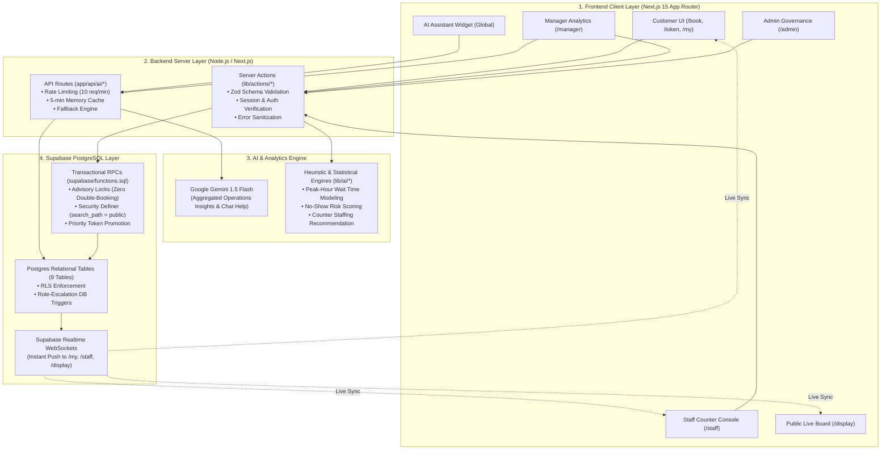

# QueueFlow — Project Structure & Architectural Guide
**Digital Queue & Appointment Management System**  
*Built by LahootiX for Hackathon 1.0*

---

## 1. Executive Summary & Architecture Overview

QueueFlow is a modern, enterprise-ready digital queue and appointment booking platform designed to eliminate waiting lines, optimize staff allocation, and provide real-time queue intelligence.

The application is built on a modern full-stack architecture:
- **Frontend / Client Layer:** Next.js 15 (App Router), React 19, TypeScript, Tailwind CSS, Lucide icons, Recharts for analytics.
- **Backend / API Layer:** Next.js Server Actions (`lib/actions/*`) and Next.js Edge/Node API Routes (`app/api/*`).
- **Database & Realtime Layer:** Supabase Managed PostgreSQL with Row-Level Security (RLS) on all 9 tables, transactional PL/pgSQL stored procedures (RPCs) with advisory locking, and WebSocket Realtime subscriptions.
- **AI & Intelligence Layer:** Google Gemini 1.5 Flash API for automated operational insights and conversational live assistance, paired with statistical predictive wait-time modeling and dynamic counter staffing recommendations.

---

## 2. Important Folders & Their Purpose

| Folder | Path | Purpose & Responsibility |
|---|---|---|
| **App Routes** | `app/` | Contains the Next.js 15 App Router pages, layouts, and API routes. Every subdirectory represents a protected or public role route. |
| **Booking Wizard** | `app/book/` | Multi-step interactive appointment booking wizard (Department &rarr; Service &rarr; Date &rarr; Real-time Slot Matrix &rarr; Confirmation). |
| **Walk-in Token** | `app/token/` | Instant walk-in token generation page with live estimated wait time, people ahead count, and confirmation badge. |
| **Customer Hub** | `app/my/` | Customer personal portal displaying active live token card (with WebSocket position updates), check-in buttons, and visit history. |
| **Staff Console** | `app/staff/` | High-frequency counter terminal for staff operators. Supports Call Next, Start, Complete, Recall, Skip, and Mark Missed actions. |
| **Manager Analytics** | `app/manager/` | Operations dashboard with real-time KPI metrics, Recharts hourly load graphs, AI staffing recommendations, and Gemini insights. |
| **Admin Control** | `app/admin/` | System governance panel managing departments, services, system rules (token limits, cancellation windows), and role permissions. |
| **Public Live Board**| `app/display/` | Full-screen kiosk display showing currently called tokens per counter, audio/visual cues, and upcoming waiting lists. |
| **AI API Endpoints** | `app/api/ai/` | Server-side endpoints: `/api/ai/insights` (manager analytical briefing) and `/api/ai/assistant` (context-aware help assistant). |
| **Reusable Components**| `components/` | Modular UI widgets including the AI Chat Widget, AI Insights Card, Notification Bell, and Navbar. |
| **UI Primitive Library**| `components/ui/` | Accessible UI building blocks (dialogs, buttons, cards, badges, tabs, tables) based on Radix / shadcn. |
| **Server Actions** | `lib/actions/` | Type-safe backend mutation actions with Zod validation, role authorization, and Supabase RPC invocations. |
| **AI Core Modules** | `lib/ai/` | Pure algorithmic intelligence modules for wait-time predictions, no-show probability scoring, and staffing optimization. |
| **Supabase Clients**| `lib/supabase/` | SSR-compatible Supabase client initializers for browser components, server components, and middleware. |
| **Database Scripts**| `supabase/` | SQL migration files: `schema.sql` (table definitions & RLS), `functions.sql` (stored RPCs), and `seed.sql` (sample historical data). |

---

## 3. Important Files & Their Purpose

| File | Location | Detailed Purpose |
|---|---|---|
| `functions.sql` | `supabase/functions.sql` | The single source of transactional truth. Contains all critical database RPCs with concurrency locks (`book_appointment`, `create_token`, `call_next_token`, `check_in`, etc.). |
| `schema.sql` | `supabase/schema.sql` | Relational schema definition for 9 tables, foreign keys, timestamps, indexes, and comprehensive Row-Level Security (RLS) policies. |
| `seed.sql` | `supabase/seed.sql` | Production-like seed dataset containing 3 departments, 7 services, 5 counters, 6 role demo accounts, and ~14 days of realistic queue history. |
| `proxy.ts` | `proxy.ts` | Next.js Edge middleware enforcing authentication, session refreshing, and route-level RBAC redirection. |
| `appointments.ts` | `lib/actions/appointments.ts` | Server actions executing booking, cancellation, reschedule, and check-in workflows. |
| `tokens.ts` | `lib/actions/tokens.ts` | Server actions generating walk-in tokens and fetching queue states. |
| `staff.ts` | `lib/actions/staff.ts` | Staff counter actions: calling next customer, starting service, finishing service, counter status switching. |
| `admin.ts` | `lib/actions/admin.ts` | Administrative mutations for user roles, department operating hours, and system-wide queuing rules. |
| `waitTime.ts` | `lib/ai/waitTime.ts` | Intelligent wait time estimation algorithm combining historical service averages with peak-hour (11 AM – 1 PM) expansion factors. |
| `noShow.ts` | `lib/ai/noShow.ts` | Machine-learning-inspired heuristic engine scoring appointment no-show probability (0.0 to 1.0) using lead time, slot timing, and history. |
| `staffRecommendation.ts` | `lib/ai/staffRecommendation.ts` | Capacity planning algorithm calculating optimal counter openings: $\lceil(\text{Demand} \times \text{AvgDuration}) / 60\rceil$. |
| `insights/route.ts` | `app/api/ai/insights/route.ts` | Secure server-side Gemini 1.5 Flash integration with Zod response validation, rate limiting, and mathematical fallback. |
| `assistant/route.ts` | `app/api/ai/assistant/route.ts` | Conversational Gemini AI endpoint powering the in-app help widget with contextual system knowledge. |
| `ai-assistant-widget.tsx` | `components/ai-assistant-widget.tsx` | Globally mounted interactive AI customer support chat window with quick prompt chips. |
| `notification-bell.tsx` | `components/notification-bell.tsx` | Real-time notification dropdown with instant toasts when a customer's turn approaches. |

---

## 4. Implementation Details: Where Appointment & Queue Logic Lives

### A. Appointment Management Logic
1. **Slot Availability Calculation:**
   - **File:** `supabase/functions.sql` &rarr; `get_available_slots(p_service_id, p_date)`
   - Computes open time windows based on department operating hours, excludes designated break periods, counts booked slots, and returns slot occupancy.
2. **Booking Concurrency & Validation:**
   - **File:** `supabase/functions.sql` &rarr; `book_appointment(...)`
   - **File:** `lib/actions/appointments.ts` &rarr; `handleConfirmBooking(...)`
   - Validates user role, enforces daily booking limits (`rules.max_appointments_per_user_per_day`), and uses PostgreSQL advisory locks to guarantee zero overbooking on parallel requests.
3. **Check-In & Priority Token Promotion:**
   - **File:** `supabase/functions.sql` &rarr; `check_in(p_appointment_id)`
   - **File:** `lib/actions/appointments.ts` &rarr; `handleCheckIn(...)`
   - Enforces the check-in window (active 30 minutes before appointment up to 15 minutes past). Automatically generates a high-priority token (`is_priority = TRUE`, token prefix `P-`) placed at the front of the queue.
4. **Missed Appointment Sweeper:**
   - **File:** `supabase/functions.sql` &rarr; `mark_missed_appointments()`
   - Automatically transitions past-due unchecked appointments to `missed` status and reopens slots.

### B. Queue & Token Lifecycle Logic
1. **Walk-in Token Creation:**
   - **File:** `supabase/functions.sql` &rarr; `create_token(p_service_id)`
   - **File:** `lib/actions/tokens.ts` &rarr; `handleGetToken(...)`
   - Blocks duplicate active tokens per user, formats token numbers with service prefixes (e.g., `A-001`, `B-002`), calculates waiting positions, and creates initial activity logs.
2. **Dynamic Queue Recalculation:**
   - **File:** `supabase/functions.sql` &rarr; `recalc_queue(p_service_id)`
   - Continuously recalibrates positions and estimated wait times for all waiting tokens when counter states or service rates change.
3. **Staff Counter Processing:**
   - **File:** `supabase/functions.sql` &rarr; `call_next_token`, `start_service`, `complete_service`, `recall_token`, `skip_token`
   - **File:** `lib/actions/staff.ts`
   - Atomic state transitions: `waiting` &rarr; `called` &rarr; `serving` &rarr; `completed`. Dispatches instant Supabase Realtime events to customer and display interfaces.

---

## 5. Implementation Details: Where AI & Intelligent Features Live

| Feature | Primary Code Files | Underlying Technique / Model |
|---|---|---|
| **Predictive Wait Times** | `lib/ai/waitTime.ts` `app/token/page.tsx` `app/my/my-tokens-client.tsx` | Statistical regression combining active waiting line depth, historical service duration averages, active counter capacity, and time-of-day peak multipliers ($1.25\times$ during 11:00 AM – 1:00 PM). |
| **No-Show Risk Predictor** | `lib/ai/noShow.ts` `lib/actions/appointments.ts` `app/staff/staff-counter-client.tsx` | Weighted risk scoring model analyzing advance booking lead time ($>5$ days $+0.25$), early/late hour slots ($+0.15$), and user historical completion ratios. Displays badges (Low / Medium / High) in staff queue. |
| **Smart Staffing Recommendations** | `lib/ai/staffRecommendation.ts` `app/manager/manager-dashboard-client.tsx` | Operations research capacity formula: $\lceil(\text{Demand} \times \text{AvgDuration}) / 60\rceil$. Recommends counter opening/closing to prevent bottlenecking. |
| **Manager Operations Insights** | `app/api/ai/insights/route.ts` `components/ai-insights-card.tsx` | **Google Gemini 1.5 Flash** server-side engine. Analyzes aggregated hourly SQL metrics. Validated with strict Zod schemas; features a 5-minute memory cache and algorithmic fallback. |
| **Interactive AI Assistant** | `app/api/ai/assistant/route.ts` `components/ai-assistant-widget.tsx` | Conversational AI widget powered by Gemini 1.5 Flash. Guided by a domain-specific system prompt to assist users with queue steps, booking policies, and navigation. |

---

## 6. How the System Connects (Data & Event Flow)

1. **User Action:** Customer books an appointment on `/book` or clicks "Get Token" on `/token`.
2. **Validation Layer:** The request reaches a Next.js Server Action (`lib/actions/*`), where inputs are sanitized with **Zod** schemas.
3. **Database Transaction:** The Server Action invokes a PostgreSQL RPC function (`supabase/functions.sql`) over authenticated Supabase connection. The RPC acquires row/advisory locks, verifies security policies, mutates database state, and records an activity audit log.
4. **WebSocket Broadcast:** PostgreSQL publishes the change via the `supabase_realtime` publication.
5. **UI Synchronization:** Connected clients (`/my`, `/staff`, `/display`) receive the payload via WebSockets without page reload.
6. **AI Enhancement:** The Manager dashboard calls `/api/ai/insights` asynchronously, transmitting non-PII operational aggregates to Gemini 1.5 Flash, which returns formatted recommendations cached for 5 minutes.

---

## 7. Security Architecture

- **Row-Level Security (RLS):** Active on all 9 tables. Customers are strictly restricted to their own appointments, tokens, and notifications. Staff access only assigned department queues.
- **Role Escalation Prevention:** Database-level trigger `prevent_self_role_escalation` on table `profiles` prohibits users from modifying their own access role.
- **Search Path Hardening:** All stored procedures (`security definer`) explicitly declare `SET search_path = public` to neutralize function hijacking attacks.
- **HTTP Security Headers:** `next.config.ts` enforces `X-Frame-Options: DENY`, `X-Content-Type-Options: nosniff`, `Referrer-Policy: strict-origin-when-cross-origin`, and `Permissions-Policy`.
- **Zero Exposed Secrets:** All sensitive service keys and Gemini API keys reside purely on the server layer; `.env.local` is excluded from source control.

---

## 8. Demo Credentials & Judge Evaluation Guide

| Role | Email | Password | Access Area | Key Testing Feature |
|---|---|---|---|---|
| **Customer** | `customer@demo.com` | `Demo@12345` | `/book`, `/token`, `/my` | Book slot, get walk-in token, live status sync |
| **Customer 2** | `customer2@demo.com` | `Demo@12345` | `/book`, `/token`, `/my` | Concurrent queue position tracking |
| **Staff** | `staff@demo.com` | `Demo@12345` | `/staff` | Counter terminal, Call Next, No-show badges |
| **Manager** | `manager@demo.com` | `Demo@12345` | `/manager` | Recharts graphs, AI Insights, Staffing capacity |
| **Admin** | `admin@demo.com` | `Demo@12345` | `/admin` | Rule adjustments, user roles, department controls |
| **Public Kiosk** | *(No login needed)* | *(Public)* | `/display` | Full-screen live TV queue board |
